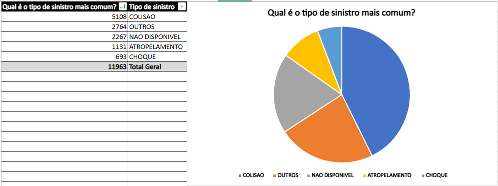
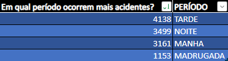

# Aula 07 — Tratamento de Dados 2

### Sobre a atividade

Análise de dados abertos do estado de São Paulo sobre sinistros de trânsito referentes a fevereiro de 2026.

---

### Análises realizadas

#### Total de sinistros em fevereiro de 2026

Utilização de funções para contagem dos registros.

---

#### Tipo de sinistro mais comum

Identificação do tipo com maior ocorrência.

---

#### Período com mais acidentes

Análise dos horários com maior incidência de sinistros.

---

#### Dia da semana mais crítico

Verificação do dia com maior número de ocorrências.

---

#### Quantidade de sinistros fatais e não fatais

Comparação entre ocorrências fatais e não fatais.

